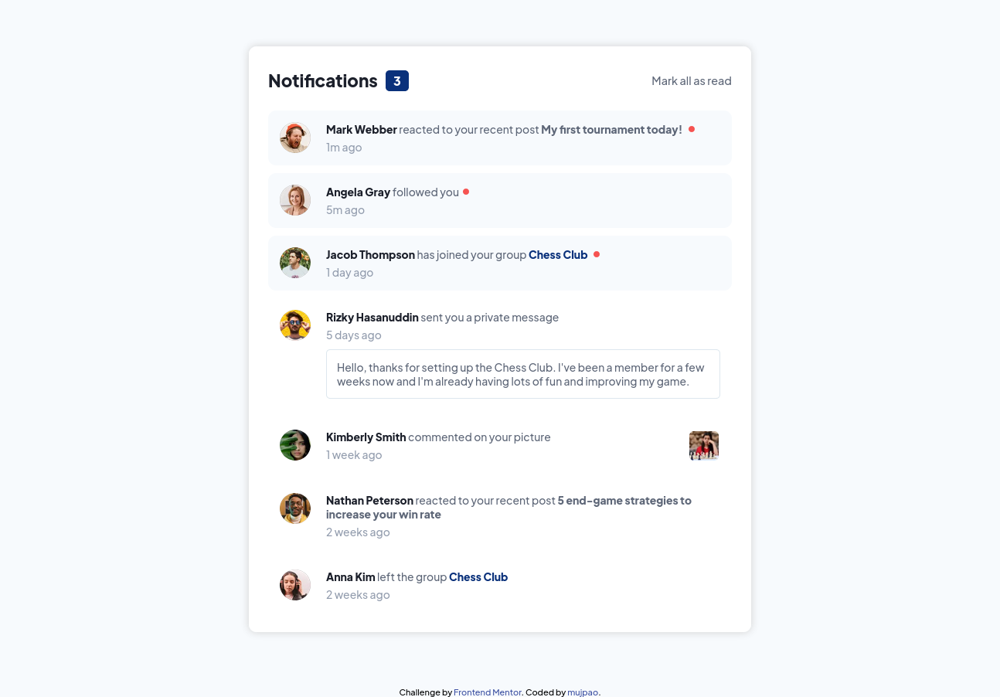
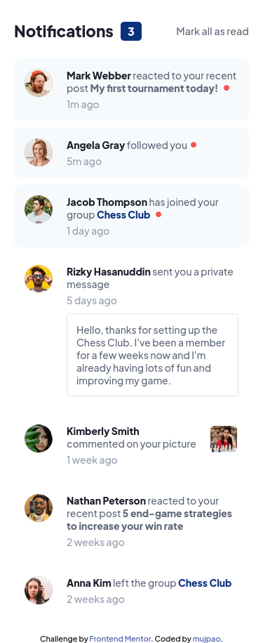

# Frontend Mentor - Notifications page solution

This is a solution to the [Notifications page challenge on Frontend Mentor](https://www.frontendmentor.io/challenges/notifications-page-DqK5QAmKbC). Frontend Mentor challenges help you improve your coding skills by building realistic projects.

## Table of contents

- [Overview](#overview)
  - [The challenge](#the-challenge)
  - [Screenshot](#screenshot)
  - [Links](#links)
- [My process](#my-process)
  - [Built with](#built-with)
  - [What I learned](#what-i-learned)
  - [Continued development](#continued-development)
  - [Useful resources](#useful-resources)
- [Author](#author)

## Overview

### The challenge

Users should be able to:

- Distinguish between "unread" and "read" notifications
- Select "Mark all as read" to toggle the visual state of the unread notifications and set the number of unread messages to zero
- View the optimal layout for the interface depending on their device's screen size
- See hover and focus states for all interactive elements on the page

### Screenshot

Desktop:

Mobile:

### Links

- Solution URL: [GitHub repo](https://github.com/mujpao/frontendmentor-notifications-page)
- Live Site URL: [Add live site URL here](https://your-live-site-url.com)

## My process

### Built with

- CSS custom properties
- Flexbox
- CSS Grid
- Mobile-first workflow

### What I learned

I used Flexbox for the header section and Grid to style the notifications section.

The notification dot is implemented using a CSS pseudo-element.

### Continued development

I want to keep practicing Grid.

### Useful resources

- [MDN article about the `::after` selector](https://developer.mozilla.org/en-US/docs/Web/CSS/::after) - This helped with implementing the notification dot.

## Author

- Website - [mujpao](https://github.com/mujpao)
- Frontend Mentor - [@mujpao](https://www.frontendmentor.io/profile/mujpao)
